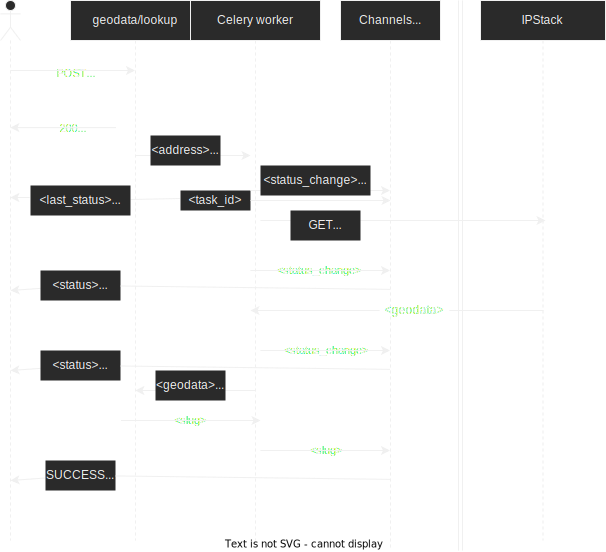

# GeoApi
The goal of this project is to allow a user to get a physical location based on the IP or a domain.

Main components of the app:
- Django Rest Framework synchronous backend for database access and REST API,
- Celery workers to connect to an external service,
- Async Django Channels backend to notify user about changes to the worker.
## Quickstart

### Requirements
- python >=3.8
- [poetry](https://github.com/python-poetry/poetry)
- redis-server

### Instructions
1.  `poetry install`
    1. `sudo apt -y install redis-server && sudo service redis-server start`
2. `poetry shell`
3. `./manage.py migrate`
4. `./manage.py createsuperuser`
   1. create your user according to instructions. Only required fields are "username" and password. You can ignore the rest
5. In a secondary poetry shell run `celery --app=geoapi.celery worker -l info`
6. While #5 is running, launch `./manage.py runserver` in the main one.
7. Navigate to `localhost:8000/api/swagger` for API documentation, or to `localhost:8000/admin` for the admin panel. You can generate tokens from `api/auth` and login to the admin using the account created in step #4

## Documentation

### REST API
`localhost:8000/api/swagger` and `localhost:8000/api/redoc`

### WS
Can be tested from a browser using [hoppscotch.io](https://hoppscotch.io/pl/realtime).
#### ws://localhost:8000/ws/geodata/<str:task-id>
- no auth
- will tell anyone with the ID how's it progressing
- final response will be a slug to grab the item from REST API.

### Flow diagram

